# La aparición del dinero en la economía

```{admonition} Dinero
Medio de cambio de curso legal, aceptado generalmente por la sociedad.
```

```{admonition} Precio
Valor de un bien o servicio fijado en unidades monetarias.
```

Como hemos visto, el sistema de trueque tiene una limitación, y es la dificultad de encontrar personas que necesiten el bien que nosotros ofrecemos, y que, a su vez, posean un bien que a nosotros nos interesa adquirir.

Para facilitar los intercambios, en el primer milenio a.C., surgió el dinero en formato moneda. Gracias a él, los intercambios de mercancía se realizaban a cambio de dinero y, con ese dinero, se podían adquirir otros bienes. Esto permitió ahorrar costes de búsqueda y favoreció la especialización y el desarrollo del comercio.

Pero el dinero supuso un gran cambio en la sociedad de la época. Para comprender la transformación que vivieron estas poblaciones, vamos a analizar el siguiente cómic, que cuenta cómo la aldea de Astérix y Obélix se convierte en una economía de mercado.

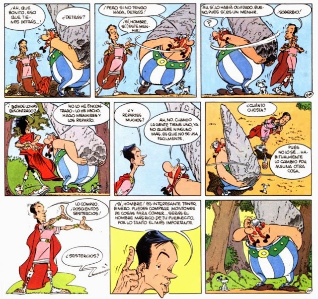

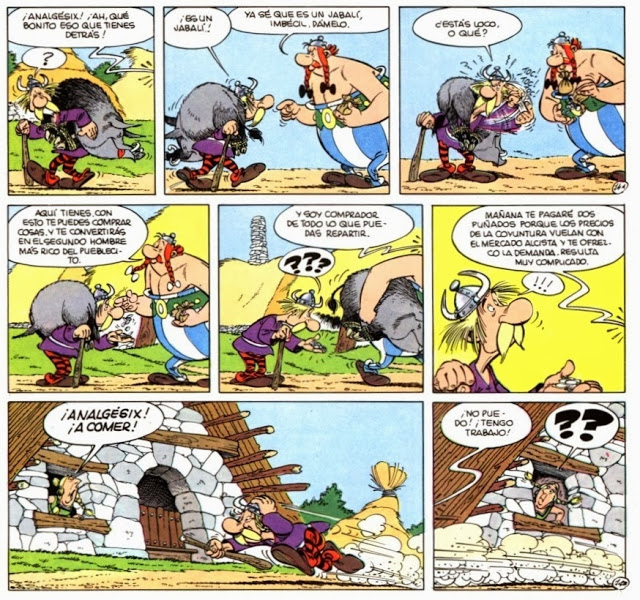
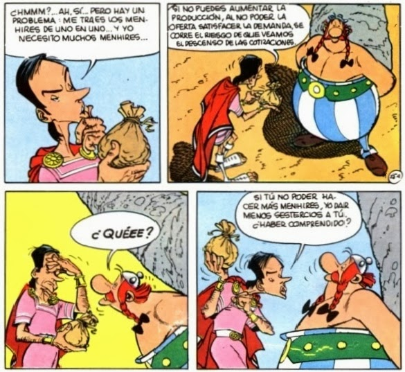
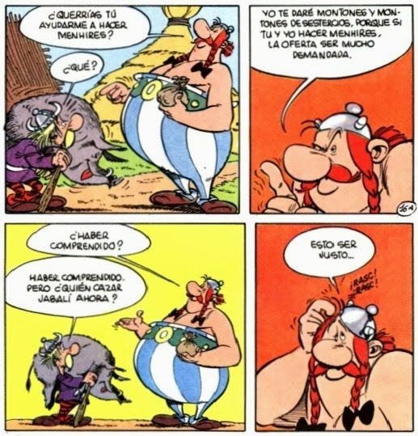
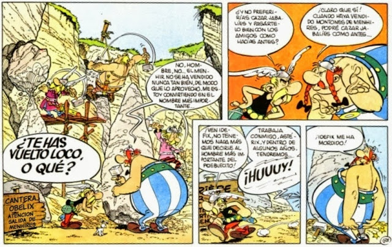
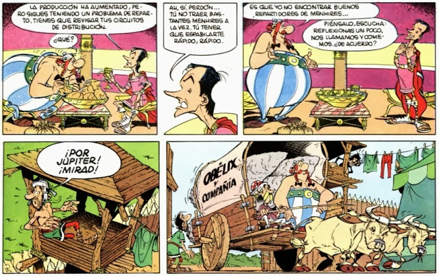

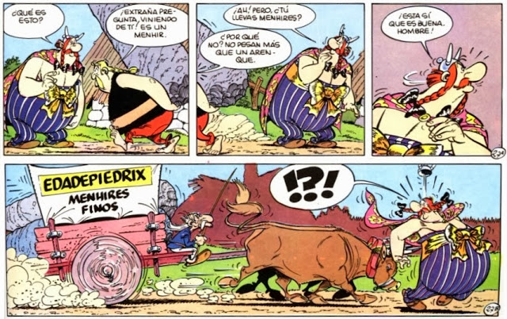
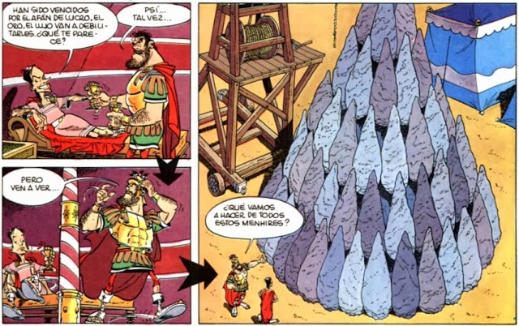
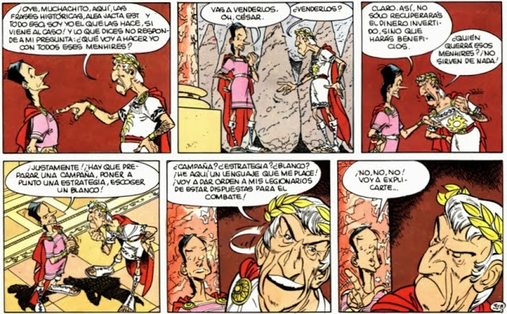
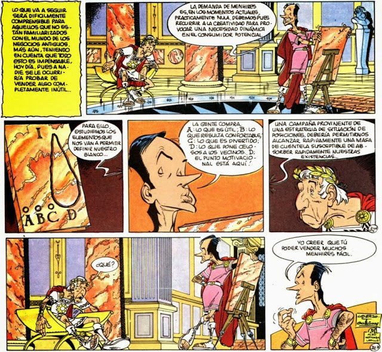

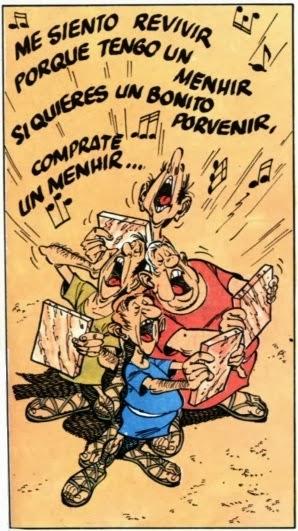
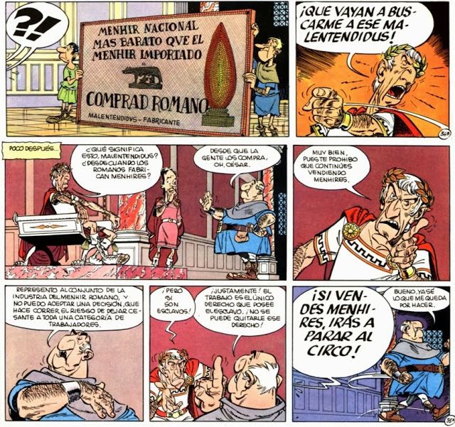
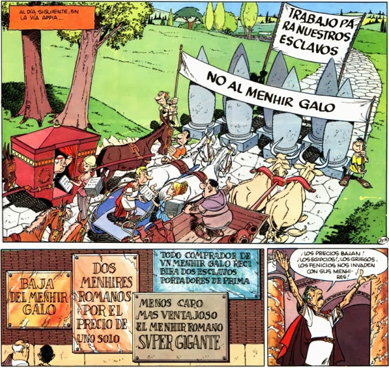
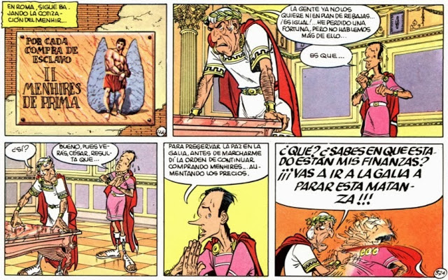
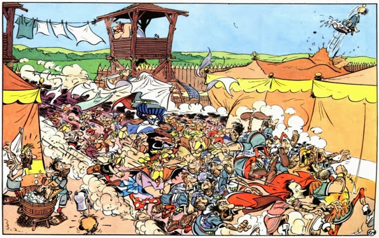


En realidad, este cómic responde a un plan de César por hundir la aldea de Astérix y Obélix. Cayo Coyuntural, quién aconseja a César, crea una demanda ficticia de menhires para obligar a los habitantes de la aldea a producirlos y así dominarlos y tenerlos entretenidos y bajo el sometimiento del orden galo.

El plan inicialmente funciona y los habitantes se convierten en empresarios y surge la división del trabajo, Coyuntural va subiendo el precio de los menhires cada vez más para estimular la oferta y convence a los habitantes de que cuanto más dinero tengan más importantes serán en el pueblo. Como consecuencia de ello, los habitantes tienen un coste de oportunidad: como tienen que trabajar ya no pueden divertirse con sus amigos.

Al final, Roma tiene tantos menhires que deciden darles venta y estimular la demanda real de los romanos mediante la publicidad. La consecuencia es que, al haber un aumento de demanda, surgen un montón de productores romanos interesados en producir también menhires y a un menor precio, por lo que compiten contra la aldea. Llega un momento en el que los menhires se han devaluado tanto que la gente no los quiere ni regalados. César ha perdido dinero y Coyuntural acude a la aldea para paralizar la compra de menhires.

Al final del cómic se nos informa de que en Roma ha habido una crisis y se ha devaluado la moneda, por lo que el dinero que han ganado los habitantes de la aldea ya no vale nada.

## Cuestiones para reflexionar

- ¿Crees que la introducción del dinero en la aldea de Astérix y Obélix ha tenido repercusiones positivas o negativas para ellos?
- ¿Crees que esta aldea estaba preparada para convertirse en una economía de mercado?
- Razona por qué han fallado los planes de César y ha terminado perdiendo dinero.
- Identifica todos los conceptos que conoces de economía y que aparecen reflejados en este cómic.
